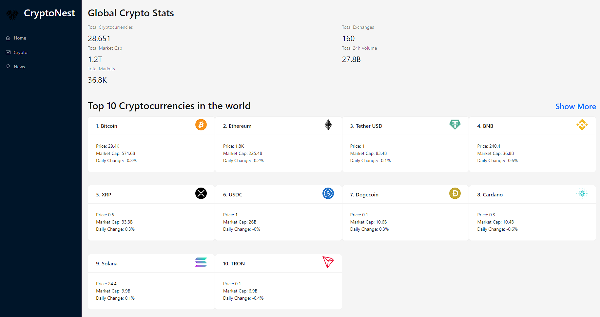
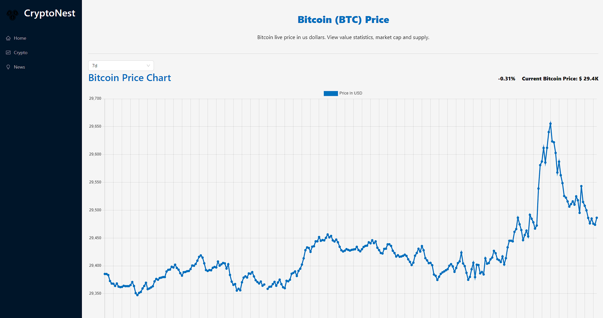
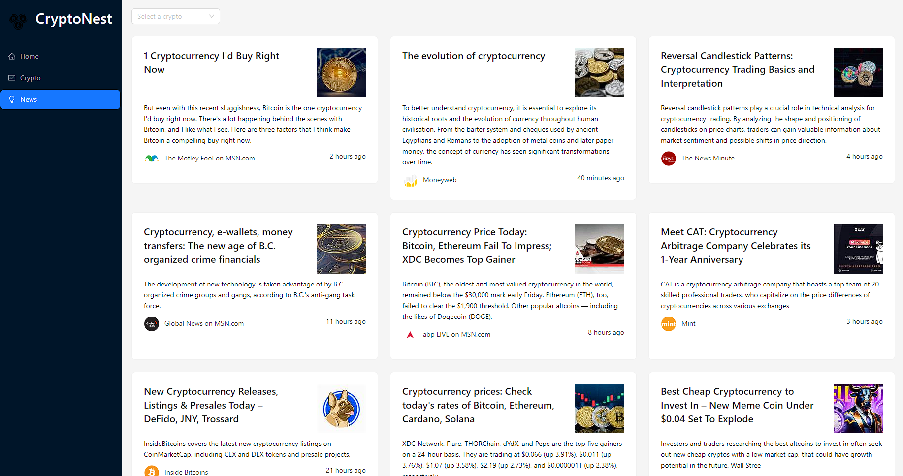

# CryptoNest - Your Ultimate Cryptocurrency Information Hub

Welcome to CryptoNest, your one-stop destination for all things cryptocurrency. This web application, built with React.js, Ant Design, and Redux RTK Query, provides real-time insights into the world of cryptocurrencies. Utilizing data from the Coinranking API and Bing News Search API, CryptoNest empowers users with comprehensive information and the latest news about cryptocurrencies.

## Demo

Check out the live demo of CryptoNest: [Demo Link](https://cryptonest.netlify.app/)

## Features

### Global Crypto Stats

Stay informed about the global cryptocurrency market with key statistics, including:

- Total Cryptocurrencies
- Total Exchanges
- Total Market Cap
- Total 24h Volume
- Total Markets

### Top 10 Cryptocurrencies

Explore the top 10 cryptocurrencies dominating the market. Get a quick overview of their rankings, current prices, and more.

### Individual Coin Details

Access detailed information about each cryptocurrency, including:

- Coin Name and Symbol
- Current Price in USD
- Rank
- 24-hour Trading Volume
- Market Capitalization
- All-time High Price

### Price History Charts

Visualize price history using interactive line charts. Select different time periods to track price fluctuations over time.

### Latest Crypto News

Stay updated with the latest crypto news articles. Get real-time updates on the ever-changing world of cryptocurrencies.

## Technologies Used

- **React.js**: Building interactive user interfaces.
- **Ant Design**: Stylish and responsive UI components.
- **Redux RTK Query**: Efficient management of API queries and data caching.
- **Chart.js**: Creating interactive and dynamic charts.
- **Coinranking API**: Real-time cryptocurrency data.
- **Bing News Search API**: Latest crypto-related news articles.

## Getting Started

1. Clone this repository.
2. Install dependencies using `npm install`.
3. Start the development server with `npm start`.

## Credits

Special thanks to Coinranking API and Bing News Search API for providing essential data.

## Authors

- [Dexter](https://github.com/soham-basak)

## Contribution

Contributions are welcome! If you encounter issues or have suggestions, feel free to create a pull request.

Explore CryptoNest and stay ahead in the cryptocurrency world today! 🚀🌐
